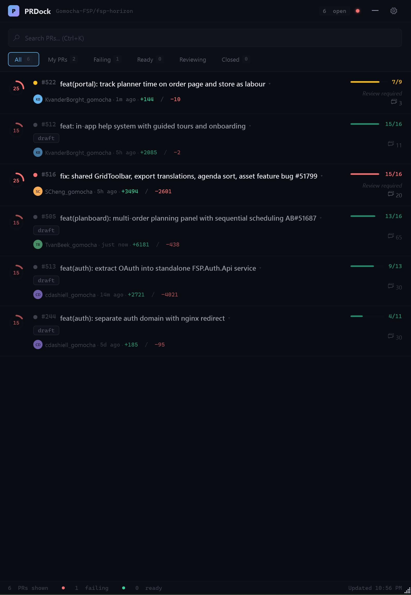
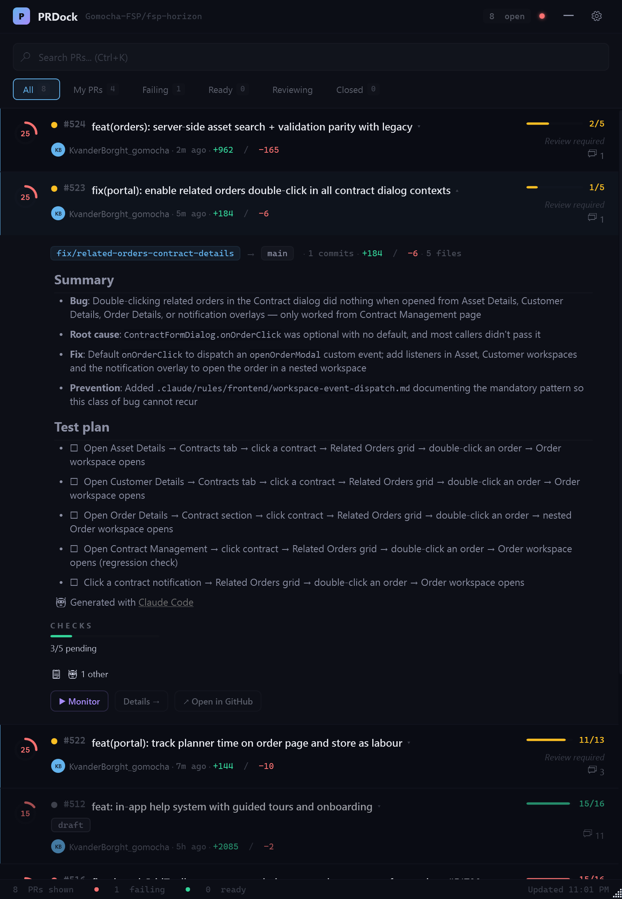
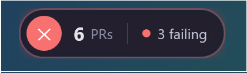
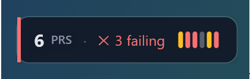
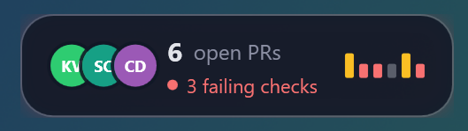
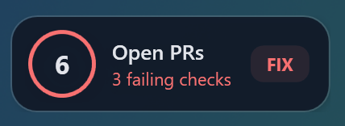
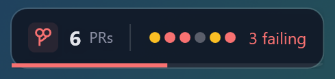

# PRDock

A lightweight desktop application that monitors GitHub pull requests as a docked sidebar overlay. PRDock surfaces CI check status, review state, and Claude Code review findings at a glance — and lets you launch automated fixes with one click.

## Screenshots

### PR Sidebar

All your open PRs in one glance. The sidebar shows every PR grouped by repository with color-coded CI status (green = passing, red = failing, yellow = pending), lines changed, review state, and author avatars. Filter by status tabs — My PRs, Failing, Ready, Reviewing, or Closed — and search across all repos instantly.



### Expanded PR Card

Click any PR to expand it inline. See the full summary, root cause, fix details, and a test plan — all without leaving the sidebar. Quick-action buttons let you re-run checks, launch a Claude Code fix session, or jump to GitHub. Branch info, file count, and diff stats are shown at a glance.



### CI Check Status

Open the detail view to see every CI check for a PR — Analyze, Build & Unit Tests, CodeQL, claude-review — with live pass/fail/pending indicators. One click on "Re-run Checks" or "Fix with Claude" to take action directly. The Overview, Checks, and Reviews tabs let you drill into exactly what you need.


### Claude Code Review

The Reviews tab renders full Claude Code review comments with Markdown formatting. See the overall assessment, categorized issues (bugs, correctness, missing contract alignment), and actionable suggestions — all inline. Approve or request changes directly from PRDock.


## Features

- **PR Monitoring** — Polls GitHub for open pull requests across configurable repositories, displaying status, reviews, and CI checks in a compact sidebar.
- **Docked Sidebar** — A chromeless WPF overlay that pins to the left or right edge of your screen, with auto-hide and hotkey toggle (`Ctrl+Win+Shift+G`).
- **CI Check Details** — Inspect failed checks inline with parsed error messages extracted from GitHub Actions logs (supports build errors, test failures, lint warnings, and runtime exceptions).
- **Claude Code Integration** — One-click launch of a Claude Code terminal session to automatically fix CI failures. PRDock finds or creates a git worktree for the PR branch and generates a targeted fix prompt.
- **Claude Review Panel** — Surfaces review comments left by Claude Code's bot, grouped by severity, with full Markdown rendering.
- **Notifications** — Windows toast notifications for check status changes, new PRs, and review updates.
- **Floating Badge** — A minimal always-on-top badge showing failing PR count when the sidebar is hidden. Five selectable styles:

  | Style | Preview | Description |
  |-------|---------|-------------|
  | **Glass Capsule** |  | Frosted glass with pulsing status ring. Subtle, elegant. |
  | **Minimal Notch** |  | Thin colored accent bar + per-PR status pips. Most compact. |
  | **Floating Island** |  | Author avatars, mini bar chart, ambient glow. Most info-dense. |
  | **Liquid Morph** |  | Animated morphing ring with FIX/OK action tag. Playful. |
  | **Spectral Bar** |  | Two-panel layout with health progress bar. Dashboard-like. |
- **Theme Support** — Light, dark, and system-following themes.
- **Setup Wizard** — First-run wizard that auto-detects `gh` CLI auth, scans for local GitHub repos, and configures worktree paths.
- **Adaptive Polling** — Rate-limit-aware polling with ETag-based conditional requests to minimize GitHub API quota usage.

## Requirements

- Windows 10 or 11 / macOS / Linux
- [Node.js](https://nodejs.org/) (LTS)
- [Rust](https://www.rust-lang.org/tools/install) (for Tauri)
- [GitHub CLI (`gh`)](https://cli.github.com/) (recommended) or a GitHub Personal Access Token

## Getting Started

```bash
# Clone the repository
git clone https://github.com/your-org/PRDock.git
cd PRDock/src/PRDock.Tauri

# Install dependencies
npm install

# Run in dev mode
npm run tauri dev
```

On first launch, the setup wizard will guide you through authentication and repository configuration.

## Project Structure

```
src/PRDock.Tauri/         # Tauri + React + TypeScript application
```

## Tech Stack

- **Tauri** for native desktop shell
- **React** + **TypeScript** for UI
- **Rust** for backend/system operations

## Security Notes

- **Content Security Policy** — The Tauri CSP restricts network access to the GitHub API, Azure DevOps, and GitHub avatar CDN. All other external requests are blocked.
- **Updater transport** — The auto-updater fetches release metadata from the GitHub API (over HTTPS), then serves it to the Tauri updater plugin via a short-lived local HTTP server on `127.0.0.1`. The `dangerousInsecureTransportProtocol` setting is required for this loopback-only server; no data is sent over the network unencrypted.
- **Credentials** — GitHub tokens are stored in the OS-level Tauri store (per-user, not in the repo). No secrets are hardcoded in the source.

## License

MIT. See [LICENSE](LICENSE).
