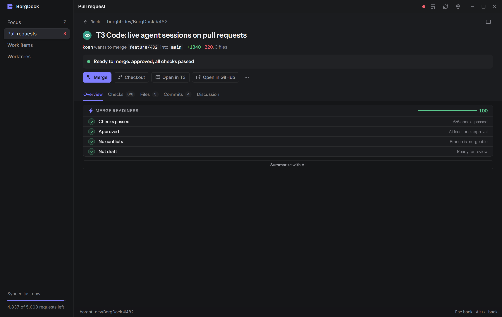
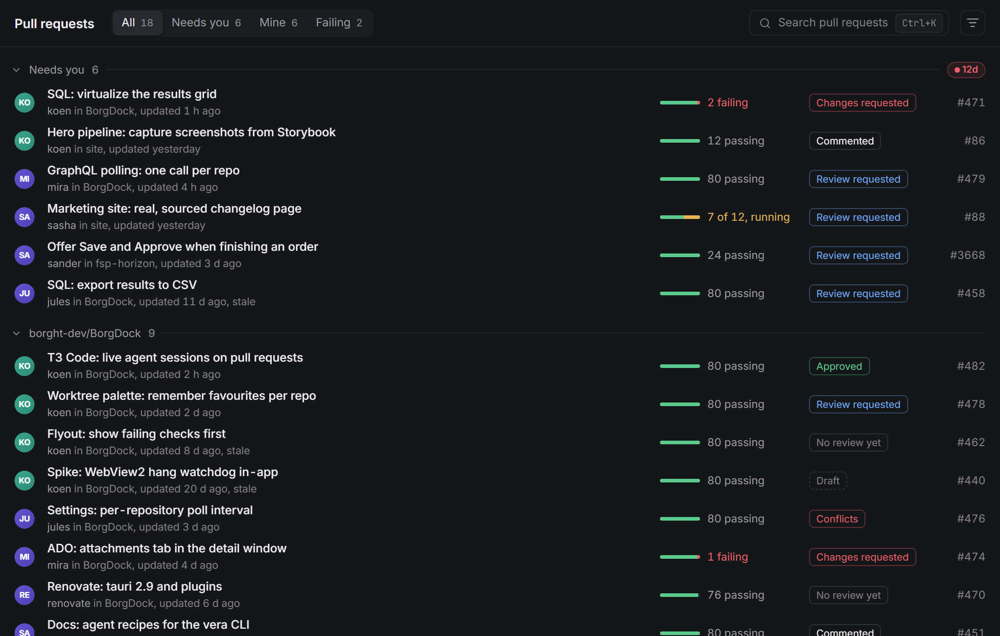
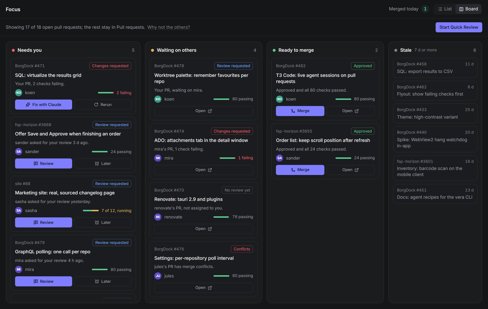
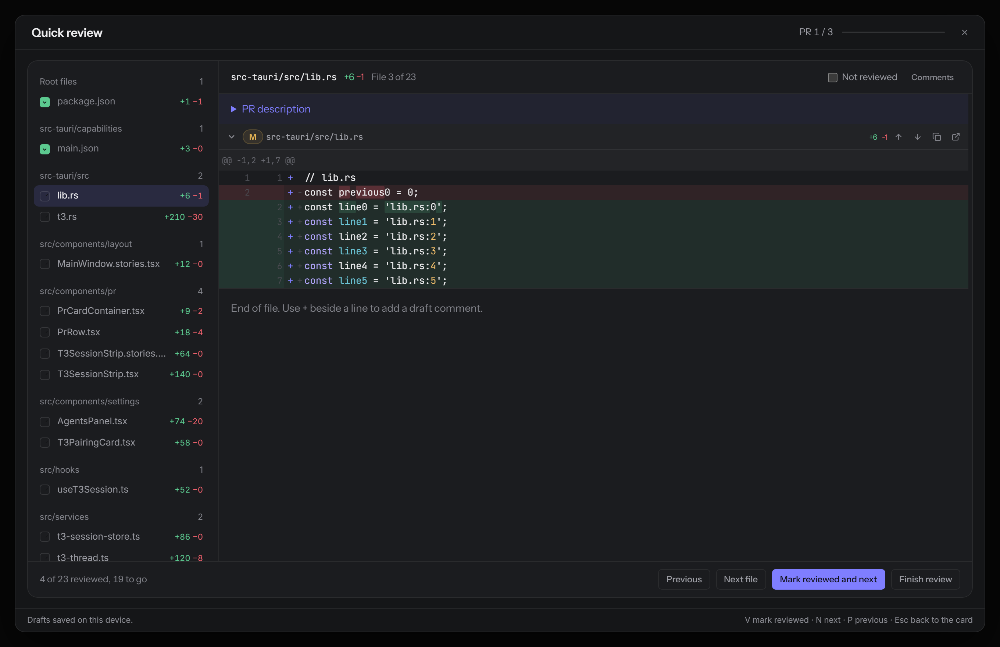
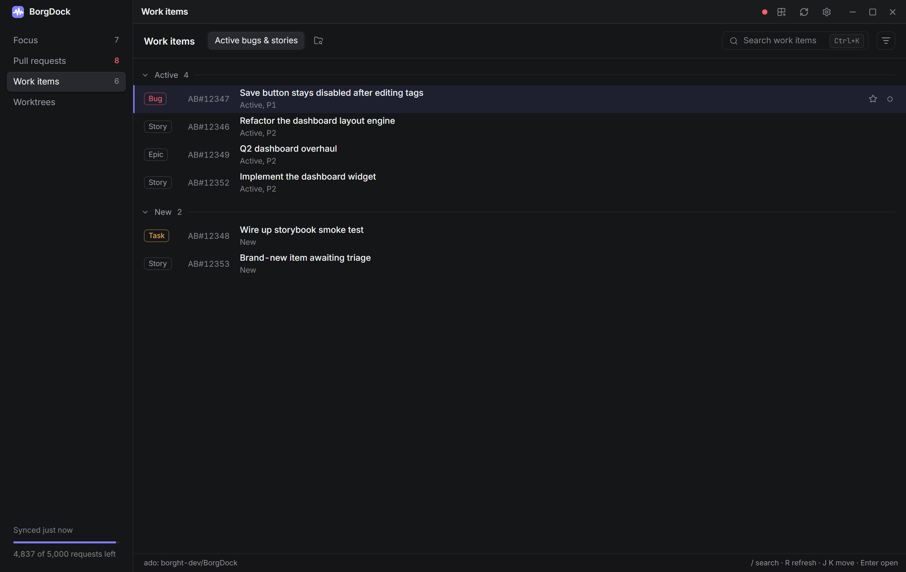
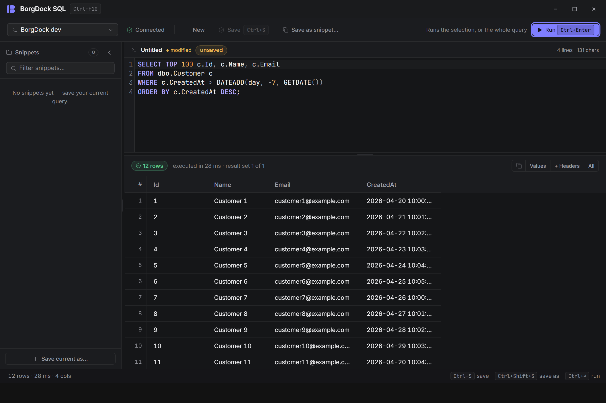

# BorgDock

A desktop app for keeping on top of GitHub pull requests, Azure DevOps work items and local worktrees. BorgDock shows what needs you, CI and review state at a glance, lets you review and merge without leaving it, and hands failing builds to Claude Code or Codex with one click.

## Screenshots

### Rail and full-screen pull requests

A rail on the left switches between Focus, Pull requests, Work items and Worktrees, with sync state and your GitHub rate at the bottom. A pull request opens full screen with its checks, files, commits and discussion; Esc or Back returns you to the same row.



### Pull request list

One quiet row per pull request: title, one line of detail, a check bar and a single review chip. Filter by All, Needs you, Mine or Failing, group by author, repository or status, and search across everything.



### Focus

Focus lists what needs you and says why ("mira asked for your review 2 d ago."). Use it as a list or as a board with Needs you, Waiting on others, Ready to merge and Stale; every card carries the one action it needs.



### Quick Review

Walk a pull request file by file, grouped by folder, skip generated files in one go, draft inline comments, and submit one GitHub review. Approve unlocks once every file that matters is marked.



### Work items and tool windows

Azure DevOps queries live in the Work items section, grouped by state. SQL, the file palette, the file viewer, Settings and the worktrees window share the main window's look.





## Features

- **Pull request monitoring** — Polls GitHub for open pull requests across your repositories (one `gh` account per repo if you need to), with CI checks, reviews and merge state.
- **Main window with a rail** — Focus, Pull requests, Work items and Worktrees, keys `1`–`4`. Pull requests and work items open full screen with Back; Ctrl+click opens a PR in its own window.
- **Focus** — A ranked list or board of what needs you, with the reason for each item, snooze with Undo, and one action per card: Review, Fix with Claude, Rerun or Merge.
- **Quick Review** — A two-column overview with required-check status, expandable file groups, progress and developer proof. Hover linked ADO items for context; click to read the existing work-item panel without leaving the review. Proof comments show their source and commit association, with hover previews and an image viewer for zoom, pan and navigation. File-by-file review retains skip-generated, inline drafts and approval gating.
- **Rerun failed checks** — Reruns the failed jobs of each GitHub Actions workflow and re-requests other apps' check suites.
- **Coding agents** — Fix, Monitor and Resolve conflicts with Claude Code or Codex in a worktree for the PR branch; open a PR-linked thread in T3 Code.
- **Tray and flyout** — Tray icon with the open-PR count on the worst state colour, and a flyout (`Ctrl+Win+Shift+F`) with compact rows, Review / Merge and a context menu.
- **Worktrees** (`Ctrl+F7`) — Every worktree of every watched repo, favourites, its changes beside the list, and the linked pull request.
- **File palette** (`Ctrl+F8`) — Filename, content (`>`) and symbol (`@`) search across worktrees with a syntax-highlighted preview and a pop-out file viewer.
- **Azure DevOps work items** (`Ctrl+F9`) — Queries, a work item palette and editable item detail, with `az` CLI or PAT auth.
- **SQL** (`Ctrl+F10`) — Queries against SQL Server with Windows or SQL auth, snippets, and a virtualized result grid.
- **Syntax highlighting** — Tree-sitter across 11 languages in diffs, the file palette and the file viewer.
- **Keyboard first** — `J`/`K` move, `Enter` opens, `Esc` goes back, `/` or `Ctrl+K` searches; the status bar shows the keys for the current view.
- **Notifications and toasts** — Tray-flyout toasts for check, review and merge events, review nudges, and in-window toasts with Undo.
- **Themes and motion** — Graphite dark, porcelain light or follow the system, shared by every window; Reduce motion in Settings → Appearance.
- **What's new** — Release notes with screenshots after each auto-update.
- **Setup wizard** — Detects `gh` auth, scans for local GitHub repos and configures worktree paths on first run.
- **Adaptive polling** — Rate-limit-aware polling with ETag requests to save GitHub API quota.

The full list is in [FEATURES.md](FEATURES.md).

## Requirements

- Windows 10 or 11 (the only packaged target; macOS and Linux build from source)
- [Bun](https://bun.sh/) 1.3 or newer
- [Rust](https://www.rust-lang.org/tools/install) (for Tauri)
- [GitHub CLI (`gh`)](https://cli.github.com/) (recommended) or a GitHub Personal Access Token
- npm CLI on PATH only if you rebuild tree-sitter grammars (see `src/BorgDock.Tauri/scripts/build-grammars.sh`)

## Getting Started

```bash
# Clone the repository
git clone https://github.com/borght-dev/BorgDock.git
cd BorgDock

# Install dependencies (single bun workspace install at the repo root)
bun install

# Run the desktop app in dev mode
bun run tauri dev
```

On first launch, the setup wizard will guide you through authentication and repository configuration.

## Project Structure

```
src/BorgDock.Tauri/         # Tauri + React + TypeScript application
site/                       # Astro marketing site and Remotion launch video
design/brand/workbench/     # Logo, app icon and tray artwork
```

## Tech Stack

- **Tauri** for native desktop shell
- **React** + **TypeScript** for UI
- **Rust** for backend/system operations

## Security Notes

- **Content Security Policy** — The Tauri CSP restricts network access to the GitHub API, Azure DevOps, and GitHub avatar CDN. All other external requests are blocked. `script-src` includes `'wasm-unsafe-eval'` so tree-sitter grammar WASMs can instantiate for syntax highlighting.
- **Updater transport** — The auto-updater fetches release metadata from the GitHub API (over HTTPS), then serves it to the Tauri updater plugin via a short-lived local HTTP server on `127.0.0.1`. The `dangerousInsecureTransportProtocol` setting is required for this loopback-only server; no data is sent over the network unencrypted.
- **Credentials** — GitHub tokens are stored in the OS-level Tauri store (per-user, not in the repo). No secrets are hardcoded in the source.

## License

MIT. See [LICENSE](LICENSE).
